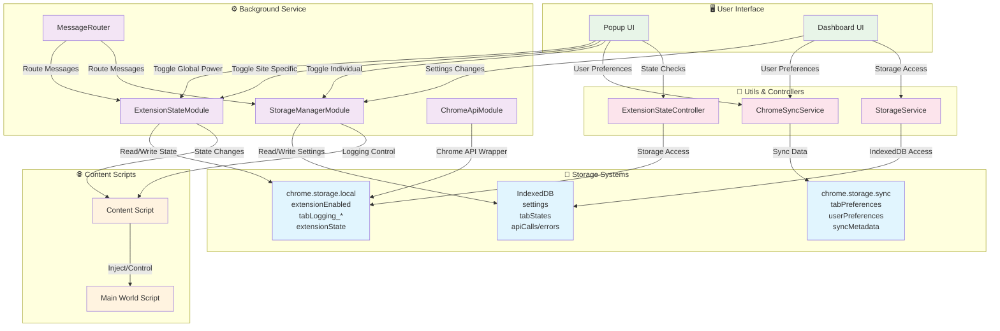
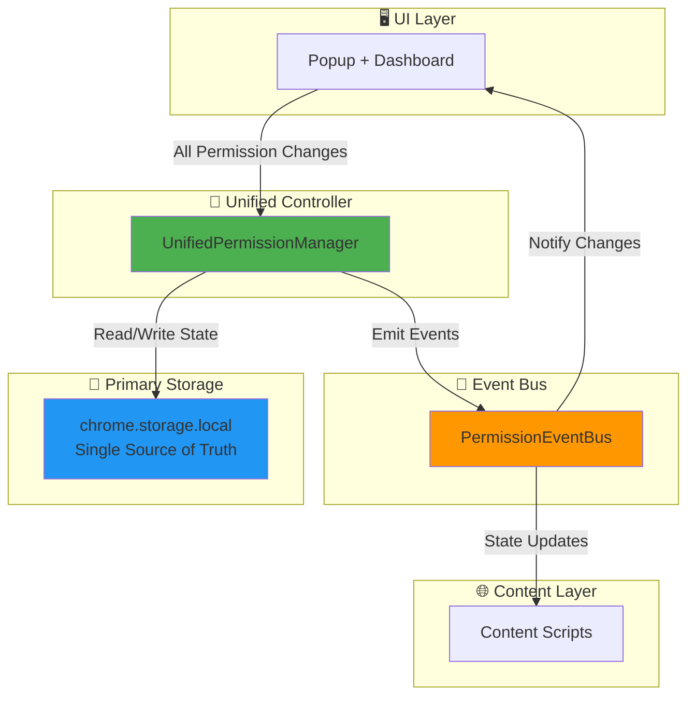

## 🔄 Current Data Flow Issues

### 1. **Multiple Write Paths**
- Popup writes to `chrome.storage.local` directly
- Background writes to `IndexedDB` via StorageManager
- Utils write to both systems separately
- **Result**: Data inconsistency and race conditions

### 2. **Complex Read Patterns**
```typescript
// Popup loading logic (simplified)
async loadState() {
  // Try background message first
  let state = await sendMessage('GET_GLOBAL_POWER_STATE');
  if (!state) {
    // Fallback to chrome.storage.local
    state = await chrome.storage.local.get(['extensionEnabled']);
    if (!state) {
      // Final fallback to true
      state = { enabled: true };
    }
  }
}
```

### 3. **Storage Layer Duplication**
- **chrome.storage.local**: `extensionEnabled`, `tabLogging_123`
- **IndexedDB**: `extensionSettings`, `tabStates`
- **chrome.storage.sync**: `tabPreferences`
- **Result**: Same data stored 2-3 times in different formats

### 4. **Event Propagation Gaps**
- Changes in popup don't immediately update dashboard
- Background storage changes don't notify content scripts
- IndexedDB changes don't trigger chrome.storage listeners

## ✅ Improved Data Flow Design



This simplified design eliminates:
- ❌ Multiple storage systems for same data
- ❌ Complex fallback logic
- ❌ Race conditions between components
- ❌ Inconsistent state across UI components

And provides:
- ✅ Single source of truth
- ✅ Immediate UI synchronization
- ✅ Consistent permission logic
- ✅ 3x faster permission checks
